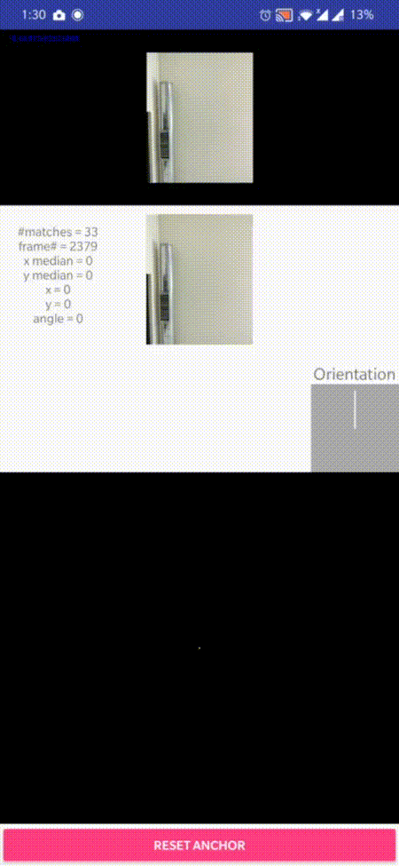
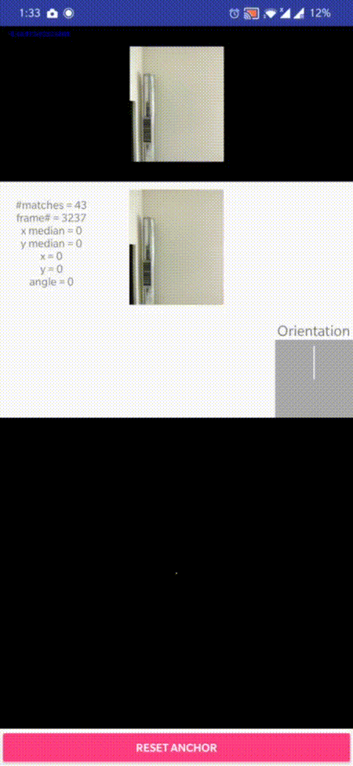
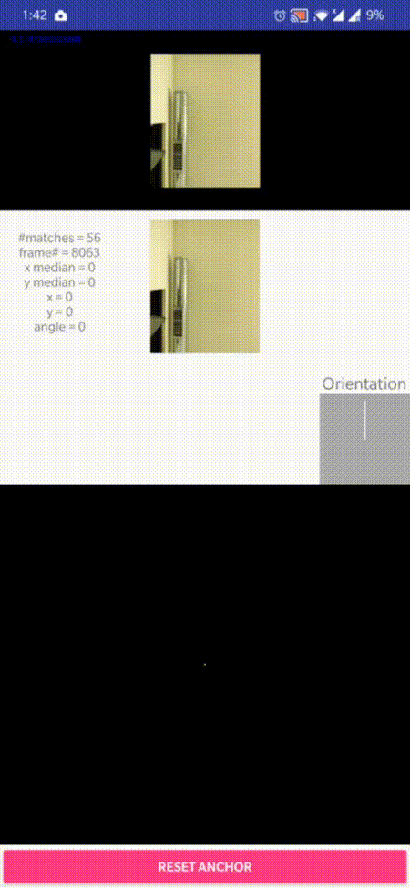
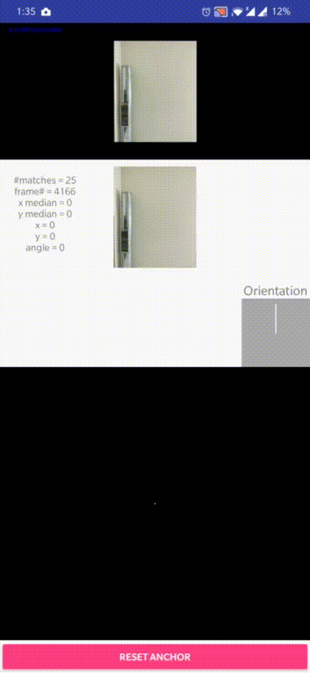
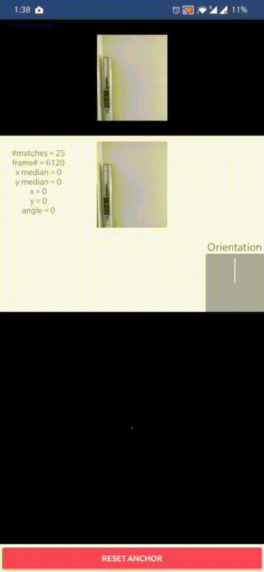
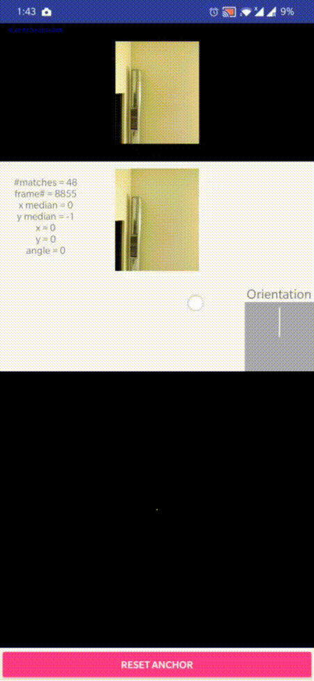

# hawkeye

## description
- A simple real-time 2D pose tracking algorithm using visual odometry.
- Designed to be deployed in a mobile phone to use it as an external-mouse-like controller.
- A rudimentary inertial odometer using accelerometer with eularian integration is provided as a control.

### assumptions
- The device is constrained to have only translation and rotation in a 2D space (ex. on a computer desk).
- We assume a static planar scene at a far enough distance with a decent number of good features to track over time.

### features
- When the device is at rest there is translation and rotation readings stay at zero i.e. there is no drift at rest.
- Can track 2D position and orientation simultaneously.
- When the video feed is interrupted for some time and then restarted, tracking resumes automatically.
- The speed at which device moves has no effect on tracking as change in pose is only a function of first frame and Nth frame.
- The above point also means that there will be no drift accumulation during the movements.

### references
- <https://www.sciencedirect.com/science/article/abs/pii/S0263224104000417>
- <https://www.sciencedirect.com/science/article/pii/S1474667016426261>

## code
- This is a typical android project written in `Kotlin`.
- `opencv` library is used for feature extraction, description and matching.
- `koma` library is used for linear algebra.
- `proposal.pdf` contains the baseline algorithm.
- `report.pdf` contains all the details of the project viz. assumptions, algorithms, analysis ...

## documentation
- The documentation of the code is itself.

## usage
- Build the app using android studio.
- Install the app in a device with front camera.
- Give camera permission for the app from the device settings.
- Place the device on a 2D plane facing a static ceiling and reset the visual odometer.
- On moving the device now, it uses the video feed to track its 2D pose and visualizes it on screen.

## demonstration

- If device at rest no translation or rotation is detected.

- Drawing a line by hand. (Translation only)

- Drawing a square by hand. (Translation only)

- Drawing a star by hand. (Translation only)

- Drawing a circle by hand. (Translation only)

- Drawing a spiral by hand. (Translation only)

- Drawing a word (CV) by hand. (Translation only)

- Rotating 90 degrees by hand. (Rotation only)

- Drawing an arc by hand. (Translation + Rotation)

- Occlusion recovery.

## roadmap
- [x] remove unnecessary opencv native libs.
- [x] remove unused test files.
- [x] remove socket station, screen\_simulator and all related stuff.
- [x] remove cv.json.
- [x] flatten engine/ dir.
- [x] remove baseline algorithm vis.
- [x] fix the anchor and video feed vis.
- [x] improve name of project.
- [ ] decrease repo size.
